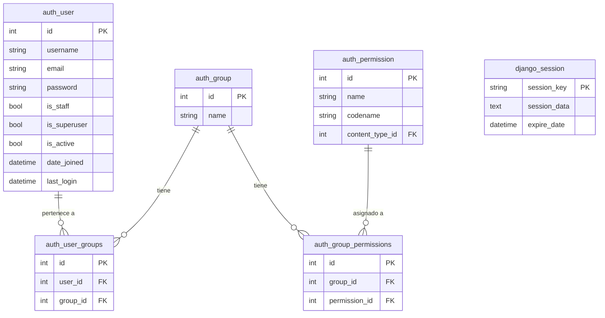
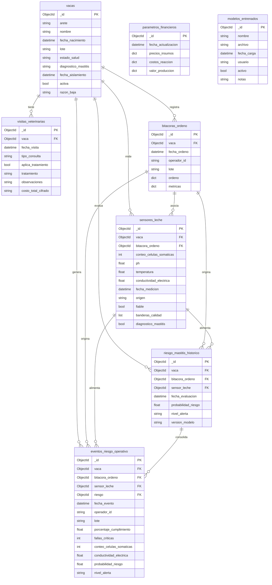

# Esquema de Bases de Datos

El proyecto usa dos bases de datos con responsabilidades distintas:

- **SQLite** - autenticación Django (`django.contrib.auth`)
- **MongoDB** - datos de dominio (vacas, bitácoras, semáforo, calculadora)

---

## SQLite - Autenticación Django

Tablas generadas automáticamente por `python manage.py migrate`. No se definen modelos propios aquí.



Los grupos usados en la aplicación son `administrador` y `operador`. El acceso a cada módulo se controla con `@login_required` y verificación de grupo en las vistas. Una mala práctica en cuanto a escalabilidad, pero por la naturaleza del proyecto pequeño, se quedará así.

---

## MongoDB - Datos de Dominio

Colecciones definidas con MongoEngine. Las referencias entre documentos se almacenan como `ObjectId` (equivalente a FK en SQL).



### Detalle de campos embebidos

**`bitacoras_ordeno.ordeno`** - documento embebido con las tres etapas del proceso:

```
ordeno: {
  pre_ordeno:       { lavado_manos, despunte_primeros_chorros, sellado_yodo, secado_toalla_limpia, fecha_pre }
  medicion_ordeno:  { colocacion_pezoneras, verificar_vacio, retirar_pezoneras, fecha_med }
  post_ordeno:      { sellado_post_ordeno, limpieza_cip, registro_temp_tanque, firma_operador, fecha_post }
}
```

**`bitacoras_ordeno.metricas`** - calculado por `calcular_metricas()`:

```
metricas: {
  pasos_cumplidos, pasos_totales, porcentaje_cumplimiento,
  fallas_criticas, hubo_falla_higiene, hubo_falla_post_ordeno, bitacora_completa
}
```

**`parametros_financieros.precios_insumos`**:

```
{ sellador_yodo_litro, toallas_paquete, prueba_cmt }
```

**`parametros_financieros.costos_reaccion`**:

```
{ precio_promedio_antibiotico, costo_promedio_consulta_vet, costo_reemplazo_vaca }
```

**`parametros_financieros.valor_produccion`**:

```
{ precio_venta_litro_leche, produccion_promedio_vaca_dia }
```

### Detalle de campos de sensores_leche

**`origen`** - indica como se registro la lectura:
- `"manual"`: ingresado por un operador desde el formulario web.
- `"api"`: recibido via API JWT (se muestra como "SENSOR" en el frontend).

**`fiable`** - booleano que indica si todos los valores estan dentro del rango permitido:
- `true`: todos los valores son validos.
- `false`: al menos un valor esta fuera de rango (solo ocurre con datos de API, ya que el ingreso manual rechaza valores invalidos).

**`banderas_calidad`** - lista de documentos con la estructura:
```
{ campo: "ph", nivel: "sospechoso|alto|no_fiable", mensaje: "pH fuera de rango normal (6.3)" }
```

### Notas

- `costo_total_cifrado` en `visitas_veterinarias` almacena el costo cifrado con Fernet. El valor real se obtiene/guarda mediante `get_costo()` / `set_costo()`.
- `parametros_financieros` actua como singleton: `obtener_vigentes()` retorna el primer documento o crea uno con valores por defecto.
- `eventos_riesgo_operativo` desnormaliza campos de otras colecciones para facilitar reportes sin joins.
- `vacas.diagnostico_mastitis` tiene tres estados posibles: `confirmado` (veterinario confirma), `sospecha_calculada` (el modelo detecto riesgo rojo), `sospecha_descartada` (veterinario descarto la sospecha). Valor `null` indica sin diagnostico.
- `sensores_leche.diagnostico_mastitis` es un booleano nullable usado como label de entrenamiento: `null` = sin evaluar, `true` = mastitis confirmada, `false` = descartada. Se actualiza automaticamente al confirmar/descartar desde el detalle de vaca.
- `modelos_entrenados` registra los modelos `.joblib` cargados. Solo uno puede estar `activo=true` a la vez. El campo `archivo` es el nombre del fichero en el directorio `modelos/`.
