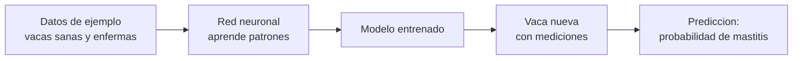
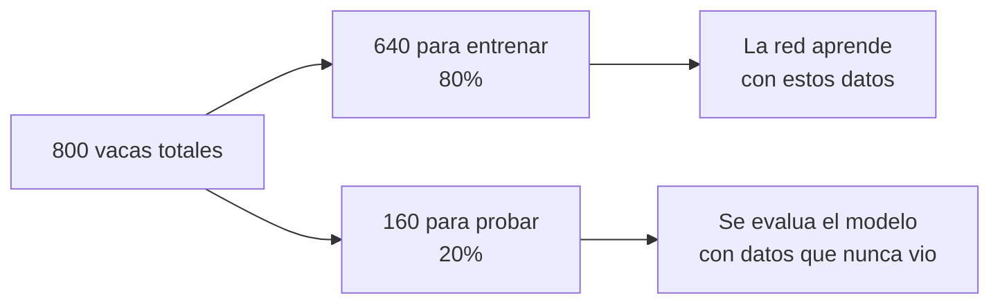
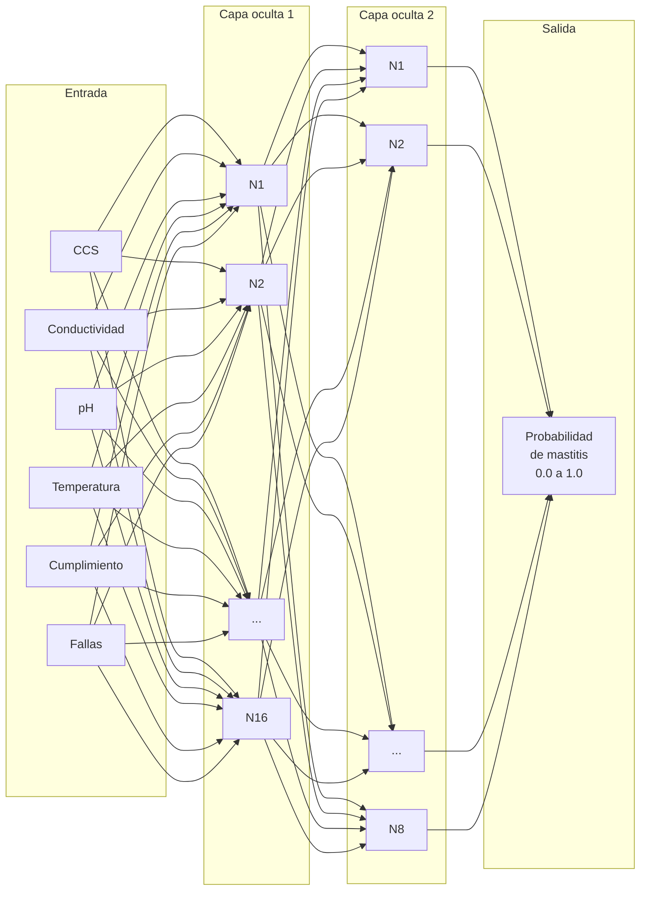
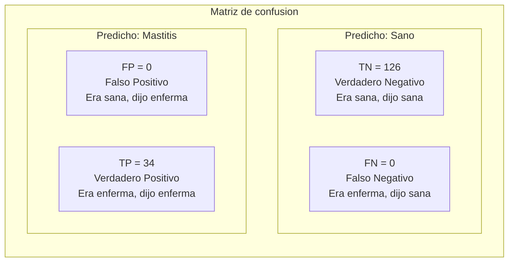
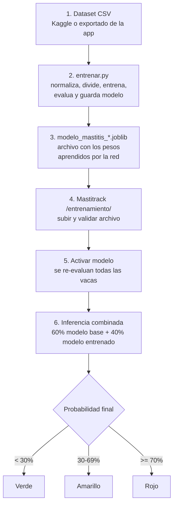
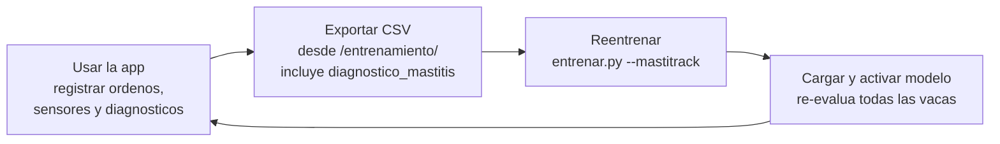

# Funcionamiento del entrenamiento del modelo de mastitis

## Que es una red neuronal (en resumen)

Una red neuronal es un programa que **aprende patrones a partir de ejemplos**. En lugar de programar reglas manualmente ("si la temperatura es mayor a 38°C, entonces hay riesgo"), le damos muchos ejemplos de vacas sanas y enfermas con sus mediciones, y la red aprende sola que combinaciones de valores indican mastitis.



## Que hace entrenar.py paso a paso

### Seleccion de fuente de datos

El script soporta dos fuentes de datos via flags mutuamente excluyentes:

```bash
uv run python entrenar.py --kaggle      # Dataset publico de Kaggle
uv run python entrenar.py --mastitrack  # Datos exportados desde la app
```

Internamente usa dos clases que heredan de `EntrenadorBase`:
- **`EntrenadorKaggle`**: usa `cow_milk_mastitis_dataset.csv`, label `class1`, valores neutros para cumplimiento/fallas.
- **`EntrenadorMastitrack`**: usa el CSV mas reciente de `mastitrack_datos_*.csv`, label `diagnostico_mastitis`, filtra registros sin diagnostico.

### Paso 1: Cargar los datos

```python
df = pd.read_csv("cow_milk_mastitis_dataset.csv")  # --kaggle
# o
df = pd.read_csv("mastitrack_datos_20260531.csv")   # --mastitrack
```

Para el dataset de Kaggle, lee 800 registros de vacas. Cada fila es una medicion de una vaca con sus indicadores de leche y una etiqueta que dice si tenia mastitis (`class1 = 1`) o no (`class1 = 0`).

Para datos de Mastitrack, usa la columna `diagnostico_mastitis` como label (1=confirmada, 0=descartada) y descarta los registros "sin evaluar".

**Salida (ejemplo con Kaggle):**
```
Dataset: 800 filas, 169 positivos (21.1%)
```

Esto significa que de 800 vacas, 169 tenian mastitis (21.1%) y 631 estaban sanas. El dataset es **desbalanceado** - hay mas vacas sanas que enfermas, lo cual es normal en la realidad.

### Paso 2: Preparar y normalizar los datos (features)

Las **features** (caracteristicas) son los valores que la red usa para hacer su prediccion. Son los "sintomas" que mide:

| Feature | Que mide | Valor alto indica |
|---------|----------|-------------------|
| CCS | Celulas somaticas en leche | Infeccion/inflamacion |
| Conductividad | Conductividad electrica de la leche | Cambios por infeccion |
| pH | Acidez de la leche | Alteracion por mastitis |
| Temperatura | Temperatura de la leche | Fiebre/inflamacion |
| Cumplimiento | Porcentaje de protocolo de ordeno cumplido | Malas practicas de higiene |
| Fallas criticas | Pasos criticos omitidos en el ordeno | Riesgo por negligencia |

#### Por que se normalizan?

Los valores originales tienen escalas muy diferentes: el CCS puede ser 350,000 mientras que el pH es 6.8. Si no los ajustamos, la red le daria mas importancia al CCS simplemente porque es un numero mas grande, no porque sea mas relevante.

La **normalizacion** convierte todos los valores a rangos similares (cercanos a 0-1):

```
CCS:           350,000  -->  350,000 / 1,000,000  =  0.35
Conductividad: 5.5      -->  5.5 / 10             =  0.55
pH:            6.8      -->  (6.8 - 6.0) / 1.0    =  0.80
Temperatura:   38.5     -->  (38.5 - 37.0) / 3.0  =  0.50
```

**Salida:**
```
Features normalizadas (media por clase):
  CCS              sano=+0.1480  mastitis=+0.5981
  Conductividad    sano=+0.4689  mastitis=+0.6780
  pH               sano=+0.6465  mastitis=+1.1099
  Temperatura      sano=-0.4863  mastitis=+0.3502
  Cumplimiento     sano=+0.0000  mastitis=+0.0000
  Fallas           sano=+0.0000  mastitis=+0.0000
```

Esto muestra el **valor promedio** de cada feature para vacas sanas vs. con mastitis. Se puede ver que hay diferencias claras: por ejemplo, el CCS promedio normalizado es 0.15 en sanas y 0.60 en enfermas.

#### Features con valores neutros (Cumplimiento y Fallas)

Notar que Cumplimiento y Fallas estan en **0.00 para ambas clases**. Esto no es un error: el dataset original (`cow_milk_mastitis_dataset.csv`) proviene de un estudio que solo midio indicadores de leche (CCS, pH, temperatura, conductividad). **No contiene datos sobre el proceso de ordeno** (cumplimiento de protocolo ni fallas criticas).

Sin embargo, la aplicacion Mastitrack **si recolecta estos datos** a traves de la bitacora de ordeno. Son features valiosas porque malas practicas de higiene durante el ordeno (no lavarse las manos, omitir el sellado post-ordeno) aumentan directamente el riesgo de mastitis.

Para el primer modelo, estos dos features se rellenan con **valores neutros**:
- Cumplimiento = 100% (protocolo perfecto) → normalizado: (100 - 100) / 100 = **0**
- Fallas criticas = 0 (ninguna falla) → normalizado: 0 / 5 = **0**

Esto significa que en el modelo inicial, estas dos features **no tienen influencia en la prediccion** — la red aprende que siempre valen cero y les asigna peso nulo. El modelo se basa exclusivamente en los 4 indicadores clinicos del sensor.

**Cuando se reentrene con datos exportados de la app**, estos campos contendran valores reales (ej: un ordeno con cumplimiento del 45% y 2 fallas criticas), permitiendo que la red aprenda la relacion entre malas practicas de ordeno y aparicion de mastitis. Esto hara que el modelo sea mas completo al incorporar tanto indicadores clinicos como operativos.

### Paso 3: Dividir en entrenamiento y prueba

```python
X_train, X_test, y_train, y_test = train_test_split(X, y, test_size=0.2)
```



Se separa el dataset en dos partes:

- **Train (640 vacas)**: la red aprende de estos ejemplos (80%)
- **Test (160 vacas)**: se usan para evaluar que tan bueno es el modelo con datos que **nunca vio durante el entrenamiento** (20%)

Esto es fundamental: si evaluaramos con los mismos datos que uso para aprender, seria como calificar un examen con las mismas preguntas que le dimos para estudiar. No sabriamos si realmente aprendio o solo memorizo.

El parametro `stratify=y` asegura que la proporcion de sanas/enfermas sea igual en ambos conjuntos.

### Paso 4: Crear y entrenar la red neuronal

```python
modelo = MLPClassifier(
    hidden_layer_sizes=(16, 8),
    activation="relu",
    solver="lbfgs",
    max_iter=1000,
    alpha=0.001,
)
modelo.fit(X_train, y_train)
```

#### Arquitectura de la red



- **6 entradas**: las features normalizadas
- **Capa oculta 1 (16 neuronas)**: detecta patrones simples en los datos
- **Capa oculta 2 (8 neuronas)**: combina los patrones para decisiones mas complejas
- **1 salida**: un numero entre 0.0 (sana) y 1.0 (mastitis)

#### Que significan los parametros

| Parametro | Valor | Que hace |
|-----------|-------|----------|
| `hidden_layer_sizes` | (16, 8) | Dos capas ocultas: la primera con 16 neuronas, la segunda con 8 |
| `activation` | relu | La funcion que decide si una neurona "se activa" o no. ReLU es la mas comun |
| `solver` | lbfgs | El algoritmo de optimizacion. L-BFGS es eficiente para datasets pequeños (<1000 filas) |
| `max_iter` | 1000 | Limite maximo de iteraciones para encontrar la solucion |
| `alpha` | 0.001 | Regularizacion: evita que el modelo "memorice" los datos en vez de aprender patrones generales |
| `random_state` | 42 | Semilla aleatoria para que el resultado sea reproducible (siempre da el mismo resultado) |

#### Que es "entrenar"?

Internamente, cada conexion entre neuronas tiene un **peso** (un numero). Al inicio son aleatorios. Durante el entrenamiento, el algoritmo:

1. Pasa los datos por la red y obtiene una prediccion
2. Compara la prediccion con la respuesta correcta
3. Calcula que tan equivocado estuvo (**loss**)
4. Ajusta los pesos para equivocarse menos la proxima vez
5. Repite hasta que el error sea minimo

**Salida:**
```
Iteraciones: 18
Loss: 0.000186
```

- **Iteraciones**: cuantas veces el algoritmo ajusto los pesos. 18 es bajo, lo que significa que los datos son relativamente faciles de separar
- **Loss**: que tan equivocado esta el modelo. 0.000186 es practicamente cero - el modelo aprendio muy bien (ver la seccion de consideraciones al final)

### Paso 5: Evaluar el modelo

Se pasan las 160 vacas de prueba (que el modelo nunca vio) y se comparan las predicciones con la realidad.

#### Reporte de clasificacion

```
              precision    recall  f1-score   support

        Sano       1.00      1.00      1.00       126
    Mastitis       1.00      1.00      1.00        34
```

| Metrica | Que significa | Ejemplo intuitivo |
|---------|--------------|-------------------|
| **Precision** | De las que predijo como enfermas, cuantas realmente lo estaban | "Cuando dice que esta enferma, que tan seguido acierta?" |
| **Recall** | De las que realmente estaban enfermas, cuantas detecto | "De todas las enfermas, cuantas logro detectar?" |
| **F1-score** | Promedio equilibrado entre precision y recall | Balance entre "no dar falsas alarmas" y "no dejar pasar enfermas" |
| **Support** | Cuantas vacas habia de cada clase en el test | 126 sanas, 34 con mastitis |

Un valor de 1.00 = 100%. En este caso el modelo acierta todas, lo cual se explica en la seccion de consideraciones.

#### Matriz de confusion

```
  TN=126  FP=  0
  FN=  0  TP= 34
```



| Sigla | Nombre | Significado | Lo ideal |
|-------|--------|-------------|----------|
| **TN** | Verdadero Negativo | Vaca sana que el modelo correctamente identifico como sana | Lo mas alto posible |
| **TP** | Verdadero Positivo | Vaca enferma que el modelo correctamente identifico como enferma | Lo mas alto posible |
| **FP** | Falso Positivo | Vaca sana que el modelo incorrectamente marco como enferma (falsa alarma) | Lo mas bajo posible |
| **FN** | Falso Negativo | Vaca enferma que el modelo no detecto (la mas peligrosa) | **Cero idealmente** - una enferma no detectada puede contagiar al resto |

En contexto veterinario, un **FN es peor que un FP**: es preferible una falsa alarma (revisar una vaca sana de mas) a dejar pasar una vaca enferma sin tratar.

### Paso 6: Distribucion del semaforo

```
  Verde     : 126 vacas (0 realmente enfermas)
  Amarillo  :   0 vacas (0 realmente enfermas)
  Rojo      :  34 vacas (34 realmente enfermas)
```

Muestra como se distribuyen las predicciones en los niveles del semaforo de la app:

| Color | Rango de probabilidad | Significado |
|-------|----------------------|-------------|
| Verde | 0% a 29% | Riesgo bajo, vaca probablemente sana |
| Amarillo | 30% a 69% | Riesgo medio, requiere observacion |
| Rojo | 70% a 100% | Riesgo alto, probable mastitis |

### Paso 7: Guardar el modelo

```python
joblib.dump(modelo, "output/modelo_mastitis_20260531_024254.joblib")
```

Serializa (guarda) el modelo entrenado con todos sus pesos en un archivo `.joblib` con timestamp en el nombre. Este archivo es el que se sube a Mastitrack desde el modulo de entrenamiento (`/entrenamiento/`).

## Flujo completo: del entrenamiento a la app



### Inferencia combinada

En la app, la prediccion final **no usa solo el modelo entrenado**. Se combina con el modelo base:

```
probabilidad = modelo_base * 0.6 + modelo_entrenado * 0.4
```

El modelo base esta hardcodeado en `inference.py` con 4 neuronas especializadas (CCS, conductividad+pH, temperatura, protocolo). Aporta una gradacion suave entre los niveles del semaforo.

El modelo entrenado aporta la senal aprendida del dataset. Como los datasets limpios (como el de Kaggle) producen predicciones extremas (0% o 99.9%), la combinacion con el modelo base asegura que haya zona verde, amarilla y roja diferenciadas.

## Consideraciones importantes

### Por que la precision es 100%?

El dataset publico de kaggle utilizado tiene clases muy bien separadas - los valores de CCS, temperatura, pH y conductividad son muy diferentes entre vacas sanas y enfermas, sin casos ambiguos. Esto es porque proviene de un entorno controlado, no de un tambo real.

**No significa que el modelo sea perfecto en la practica.** En condiciones reales de campo hay mastitis subclinica, variabilidad ambiental, ruido en sensores, etc. Cuando se entrene con datos reales exportados de la app, la precision bajara y la matriz de confusion mostrara FP y FN, lo cual es esperable y saludable.

### Ciclo de mejora

El modelo esta pensado para mejorar con el uso:



1. **Registrar datos**: ordenos, sensores de leche, y confirmar/descartar diagnosticos de mastitis desde el detalle de cada vaca.
2. **Exportar**: el CSV incluye la columna `diagnostico_mastitis` que `EntrenadorMastitrack` usa como label.
3. **Reentrenar**: `entrenar.py --mastitrack` filtra registros sin diagnostico y usa los confirmados/descartados.
4. **Activar**: al activar el nuevo modelo, la app re-evalua automaticamente todas las vacas con datos de sensor.

Cada version del modelo queda registrada en el historial, y cada evaluacion de riesgo guarda con que version se hizo, permitiendo comparar el rendimiento entre versiones.
